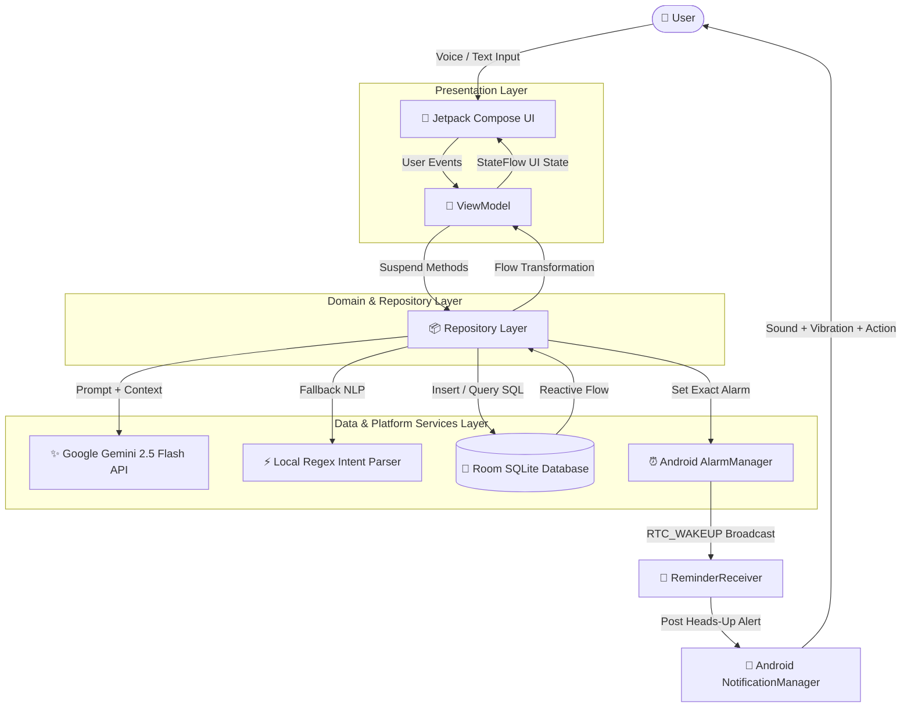
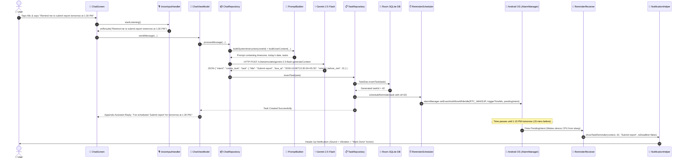
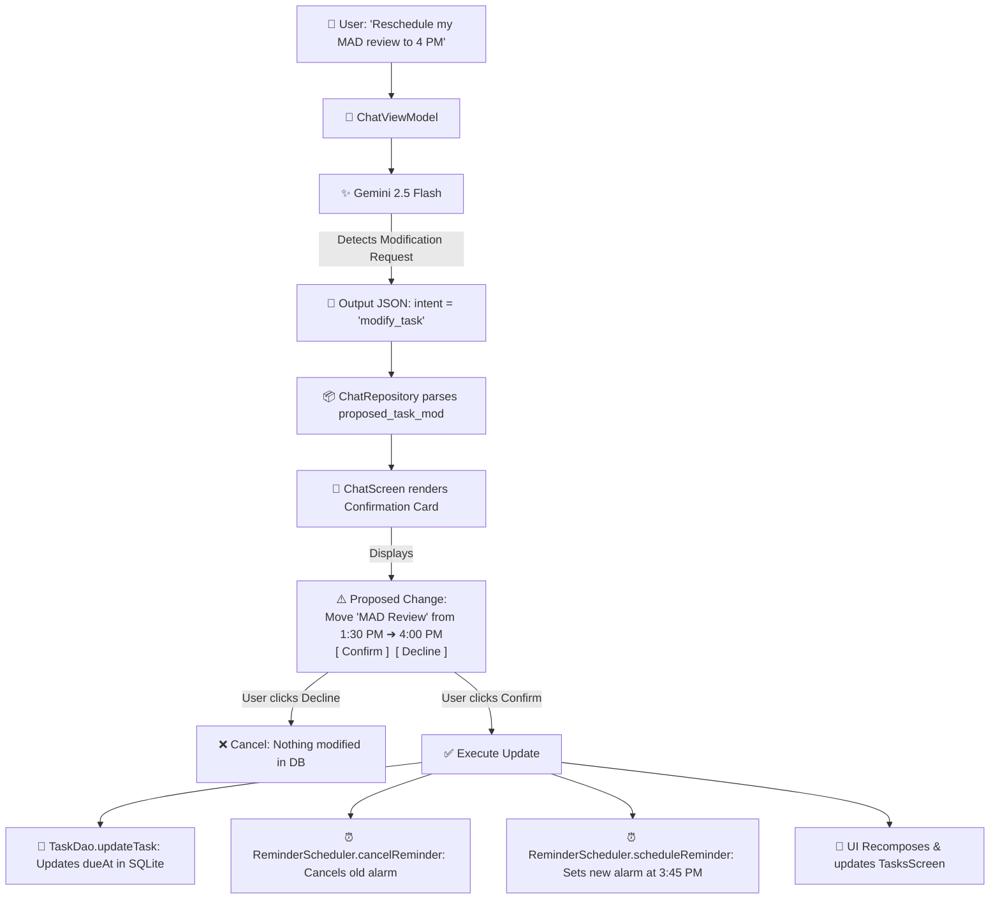
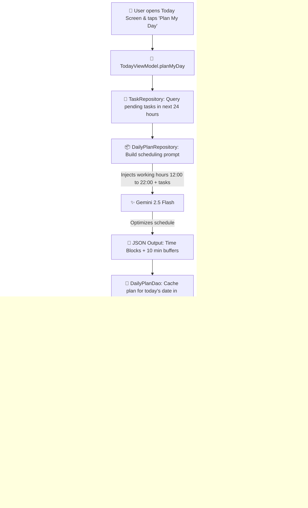
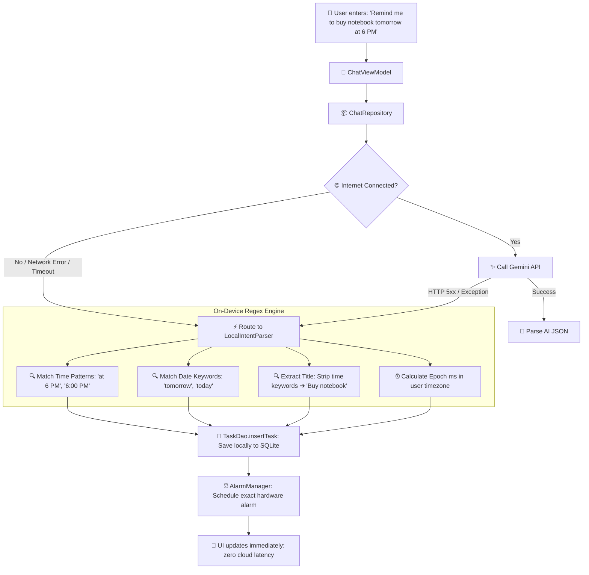

# 🔄 System Workflow & Data Flows Guide
**Project**: AI Personal Coordinator & Smart Task Manager  
**Purpose**: Visual diagrams and step-by-step execution traces explaining exactly *"how it works, then how each step executes under the hood"* for your PPT presentation and viva defense.

---

## 📌 Table of Contents
1. [Master System Architecture Flowchart](#1-master-system-architecture-flowchart)
2. [Workflow 1: Voice/Chat ➔ AI Parsing ➔ Room Database ➔ Exact Alarm Firing](#2-workflow-1-voicechat--ai-parsing--room-database--exact-alarm-firing)
3. [Workflow 2: Task Rescheduling & Interactive User Confirmation](#3-workflow-2-task-rescheduling--interactive-user-confirmation)
4. [Workflow 3: AI Daily Plan Generation & Execution](#4-workflow-3-ai-daily-plan-generation--execution)
5. [Workflow 4: Offline-First Zero-Network Fallback Engine](#5-workflow-4-offline-first-zero-network-fallback-engine)
6. [Workflow 5: Timezone Auto-Detection & Reactive Calendar Sync](#6-workflow-5-timezone-auto-detection--reactive-calendar-sync)
7. [Quick Reference Matrix for Viva Demonstrations](#7-quick-reference-matrix-for-viva-demonstrations)

---

## 1. Master System Architecture Flowchart

### Mermaid Diagram


### ASCII Architecture Diagram
```
  [ USER ]
     │  (Voice or Text Command)
     ▼
┌────────────────────────────────────────────────────────┐
│ 1. PRESENTATION LAYER (Jetpack Compose UI)             │
│    ChatScreen / TodayScreen / TasksScreen              │
└──────────────────────────┬─────────────────────────────┘
                           │ (Delegates event)
                           ▼
┌────────────────────────────────────────────────────────┐
│ 2. VIEWMODEL LAYER                                     │
│    ChatViewModel / TodayViewModel / TasksViewModel     │
└──────────────────────────┬─────────────────────────────┘
                           │ (Calls suspend functions)
                           ▼
┌────────────────────────────────────────────────────────┐
│ 3. REPOSITORY LAYER                                    │
│    ChatRepository / TaskRepository / DailyPlanRepo     │
└─────────────┬─────────────────────┬──────────────────┬─┘
              │                     │                  │
   (Network Request)        (If Network Down)    (Save/Query)
              ▼                     ▼                  ▼
┌──────────────────────┐  ┌──────────────────┐  ┌──────────────────┐
│ 4. REMOTE AI ENGINE  │  │ 5. OFFLINE NLP   │  │ 6. LOCAL ROOM DB │
│  Google Gemini 2.5   │  │  LocalIntent     │  │  SQLite Tables   │
│  (JSON Schema Mode)  │  │  Parser (Regex)  │  │  tasks, notes    │
└──────────────────────┘  └──────────────────┘  └────────┬─────────┘
                                                         │
                                        (When dueAt is present)
                                                         ▼
                                                ┌──────────────────┐
                                                │ 7. SYSTEM ALARM  │
                                                │  AlarmManager    │
                                                │  RTC_WAKEUP      │
                                                └────────┬─────────┘
                                                         │
                                                (At exact minute)
                                                         ▼
                                                ┌──────────────────┐
                                                │ 8. NOTIFICATION  │
                                                │  ReminderReceiver│
                                                │  & Channel Alert │
                                                └──────────────────┘
```

---

## 2. Workflow 1: Voice/Chat ➔ AI Parsing ➔ Room Database ➔ Exact Alarm Firing

This is the primary user journey: turning conversational natural language into an exact hardware alarm.

### Mermaid Sequence Diagram


### Step-by-Step Technical Execution Trace

| Step | Component / File | What Happens Under the Hood |
| :--- | :--- | :--- |
| **1. Capture** | `VoiceInputHandler.kt` | Android native `SpeechRecognizer` captures audio buffers from microphone, detects speech endpoints, and emits final string. |
| **2. ViewModel** | `ChatViewModel.kt` | Adds user message to `uiState`, inserts into `ChatDao`, and triggers coroutine in `viewModelScope`. |
| **3. Context Engine** | `PromptBuilder.kt` | Retrieves active user timezone (`TimezoneManager.getUserZoneId()`), calculates localized ISO timestamp, appends existing tasks for context, and locks date definitions (`Today is Mon, Oct 5. Tomorrow is Tue, Oct 6`). |
| **4. Inference** | `GeminiLlmService.kt` | Calls Gemini 2.5 Flash with `responseMimeType = "application/json"`. The model extracts entities and calculates the target timestamp in the user's timezone. |
| **5. Storage** | `TaskRepository.kt` | Converts JSON to `Task` data class and executes `taskDao.insertTask(task)`. SQLite generates an autoincrement primary key ID. |
| **6. Alarm Scheduling** | `ReminderScheduler.kt` | Calculates exact trigger time: `triggerTimeMs = task.dueAt - (task.remindBeforeMin * 60 * 1000)`. Constructs an explicit `PendingIntent` targeting `ReminderReceiver`. |
| **7. OS Registration** | Android `AlarmManager` | Calls `setExactAndAllowWhileIdle(RTC_WAKEUP, triggerTimeMs, pendingIntent)`. `RTC_WAKEUP` wakes the device from sleep; `setExactAndAllowWhileIdle` instructs the OS to bypass Doze mode. |
| **8. Background Wakeup** | `ReminderReceiver.kt` | At the exact minute, Android OS delivers the broadcast. The receiver extracts task ID and title from intent extras. |
| **9. User Alert** | `NotificationHelper.kt` | Issues a notification on high-importance channel `task_reminders` with sound, vibration pattern `[0, 250, 250, 250]`, and "Mark Done" action button. |

---

## 3. Workflow 2: Task Rescheduling & Interactive User Confirmation

How the app prevents accidental AI overwrites by requiring interactive visual confirmation.

### Mermaid Flowchart


### Step-by-Step Breakdown
1. **Ambiguity Resolution**: The user specifies a relative change (*"Move it to 4 PM"*). Gemini matches the task from the pre-injected task context by ID.
2. **Safety Hold**: Rather than instantly mutating the database, the backend sets `intent = "modify_task"` and populates `proposed_task_mod`.
3. **Interactive UI Card**: `ChatScreen` detects `proposed_task_mod != null` and displays a distinct confirmation widget with original and proposed times.
4. **Transactional Update**:
   - If the user taps **Decline**, the proposal is cleared without touching the database.
   - If the user taps **Confirm**, the `TaskRepository` updates the SQLite row, cancels the previous pending alarm via `alarmManager.cancel(pendingIntent)`, and registers the new alarm time.

---

## 4. Workflow 3: AI Daily Plan Generation & Execution

How the app generates an optimal, time-blocked daily schedule with rest buffers.

### Mermaid Flowchart


### Step-by-Step Breakdown
1. **Trigger**: User taps "Plan My Day" button in `TodayScreen`.
2. **Task Filtering**: `TodayViewModel` queries Room for pending tasks between now and 24 hours in the future (`dueAt` within range or priority deadlines).
3. **Constraint-Based Prompting**: `PromptBuilder` instructs Gemini:
   - Schedule tasks only between working hours (`12:00 to 22:00`).
   - Prioritize hard deadlines first.
   - Place a mandatory 10-minute buffer between consecutive task blocks.
   - Never schedule in the past relative to current local time.
4. **Persistence**: The resulting JSON blocks are saved to the `daily_plans` SQLite table indexed by date (`"2026-10-06"`).
5. **Interactive Execution**: The user checks off blocks throughout their day, automatically updating daily statistics cards.

---

## 5. Workflow 4: Offline-First Zero-Network Fallback Engine

How the app guarantees 100% operational reliability even without an internet connection or in airplane mode.

### Mermaid Flowchart


### Step-by-Step Breakdown
1. **Network Attempt**: The app always attempts the Gemini API first for rich natural language understanding.
2. **Graceful Degradation**: If an `IOException`, `SocketTimeoutException`, or `UnknownHostException` occurs, the `try-catch` block catches the exception.
3. **Local Intent Parser**: The text is passed to `LocalIntentParser.kt`:
   - Uses compiled `Regex` patterns to detect times (`(\d{1,2})(?::(\d{2}))?\s*(am|pm)`).
   - Detects relative dates (`tomorrow`, `today`, `in \d+ mins`).
   - Computes target epoch milliseconds using `TimezoneManager.getUserZoneId()`.
4. **Guaranteed Execution**: The task is saved into local SQLite and scheduled in `AlarmManager` with **0 network packets sent**, ensuring the user is never left stranded without reminders.

---

## 6. Workflow 5: Timezone Auto-Detection & Reactive Calendar Sync

How the app solves timezone discrepancies between cloud emulators and the user's real location.

### Mermaid Flowchart
```mermaid
graph TD
    A[👤 User taps Timezone Chip in Header] --> B[📱 TimezoneSelectionDialog opens]
    
    B -->|Selects 'India - IST' or 'Auto-detect'| C[⚙️ TimezoneManager.setTimezone]
    
    C --> D[💾 SharedPreferences: Persist zoneId = 'Asia/Kolkata']
    C --> E[📡 _userZoneIdFlow emits new ZoneId]
    
    subgraph Reactive_UI_Updates [Reactive UI Pipeline]
        E --> F[🧠 TasksViewModel: Re-evaluates LocalDate.now]
        E --> G[🧠 TodayViewModel: Re-evaluates Today's Date]
        E --> H[📝 PromptBuilder: Re-anchors AI System Prompt]
        
        F --> I[🔄 Group headers recalculate: 'Tomorrow (Tue, Oct 6)']
        G --> J[🔄 Greeting updates: 'Good afternoon, Himanshu']
        H --> K[✨ AI schedules relative terms strictly in IST]
    end
    
    I & J --> L[🎨 Jetpack Compose UI recomposes automatically]
```

### Step-by-Step Breakdown
1. **User Control**: The user taps the Timezone Chip in the header (`TasksScreen` or `TodayScreen`).
2. **State Emission**: When a timezone is selected (e.g. `Asia/Kolkata` · UTC+5:30), `TimezoneManager` emits the new `ZoneId` through `userZoneIdFlow`.
3. **Reactive Re-calculation**:
   - `TasksViewModel` combines `TimezoneManager.userZoneIdFlow` with `TaskRepository.allTasks`.
   - `LocalDate.now(userZone)` re-evaluates which tasks are `Today` vs `Tomorrow` vs `Upcoming`.
   - Headers immediately update to show explicit calendar dates: `Tomorrow (Tue, Oct 6)`.
4. **Prompt Synchronization**: Next time the user talks to the AI, `PromptBuilder` passes the updated timezone and local timestamp, guaranteeing the AI never schedules based on the server's clock.

---

## 7. Quick Reference Matrix for Viva Demonstrations

| Feature Demonstrated | Key Files Involved | What to Tell the Examiner |
| :--- | :--- | :--- |
| **Voice Scheduling** | `VoiceInputHandler.kt`, `GeminiLlmService.kt` | *"We capture speech via Android SpeechRecognizer, send it to Gemini with JSON Schema mode, parse the entities, and save directly to SQLite."* |
| **Exact Alarms** | `ReminderScheduler.kt`, `ReminderReceiver.kt` | *"We use `AlarmManager.setExactAndAllowWhileIdle` with `RTC_WAKEUP` so reminders fire with sound and vibration even in Android Doze mode."* |
| **Task Confirmation** | `ChatScreen.kt`, `ChatRepository.kt` | *"For task modifications, the AI proposes the change in a visual card. We require user tap confirmation before mutating the database."* |
| **Offline Fallback** | `LocalIntentParser.kt`, `TaskRepository.kt` | *"If network is unavailable, our local regex NLP engine takes over, scheduling tasks and alarms with zero internet access."* |
| **Timezone Sync** | `TimezoneManager.kt`, `DateTimeUtils.kt` | *"We inject the active user timezone into the AI prompt and UI grouping to prevent cloud vs client date discrepancies."* |

---

*This document is ready to be referenced directly during your presentation slides and viva examination!*
